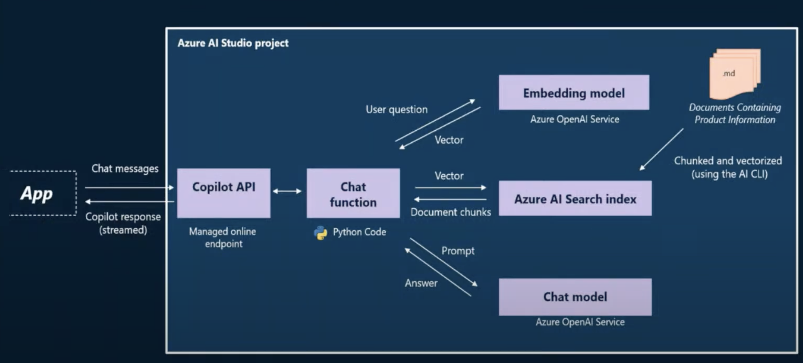
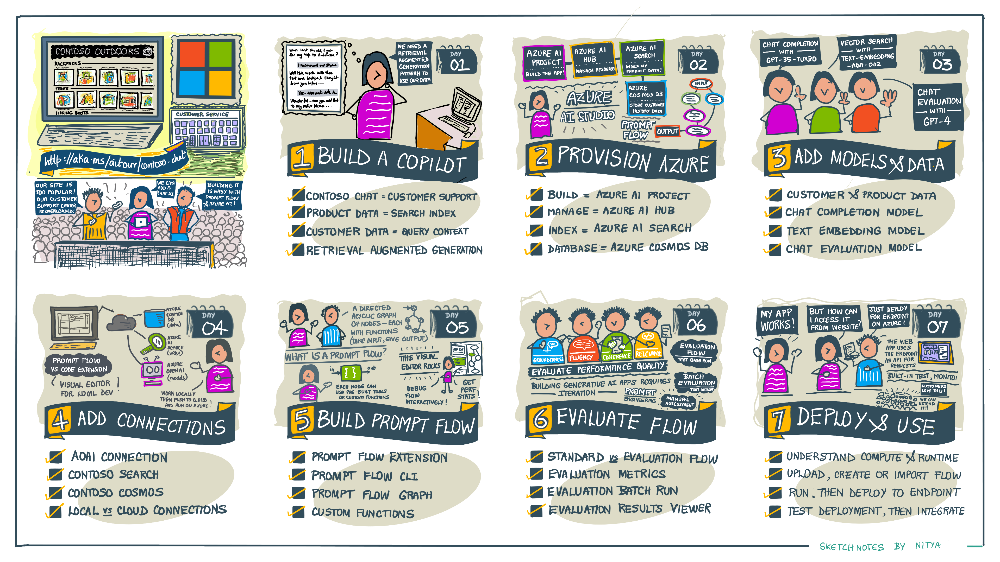

# Deconstructing Contoso Chat

> [!NOTE]  
> This is the developer guide associated with the [Contoso Chat](https://aka.ms/ai-studio/contoso-chat) sample. The sample is actively evolving and the developer guide may not reflect the latest changes. Please refer to the [Contoso Chat](https://aka.ms/ai-studio/contoso-chat) README for the most up-to-date information.

---

## Contoso Outdoors: Chat UI

Contoso Outdoors is a fictitious retailer that sells a variety of camping and hiking gear to outdoor adventurers. The company has a website (`contoso-web`) that displays the catalog of available products, allowing customers to click on any product to learn more details about what it supports.

## Contoso Chat: Retail Copilot

Contoso Chat (`contoso-chat`) is the AI-powered chatbot that adds an AI-driven customer support feature to the website. It is implemented as a _retail copilot_ that uses retrieval augmented generation to ground customer responses in the company's product catalog and customer data. Visitors to the site can now ask questions about available products, and even get recommendations based on their previous purchases.

## The Copilot Architecture

The copilot implementation uses a Retrieval Augmented Generation architecture that grounds the chat AI responses in your data. The high level architecture is shown below:

The main components are:
 - **App** - this is the chat UI frontend. It can be an application (like the Contoso Outdoors website) or any client capable of making HTTP requests to the REST API.
 - **API** - this is the copilot API endpoint. It provides a REST API for the chat AI backend, to support user interactions (request-response).
 - **AI** - this is the chat AI backend. It consists of the chat function (code-first) that _orchestrates_ multiple steps of the workflow required to process the user request.

Here, the function implements a _retrieval augemented generation_ pattern with three steps:
 - **Retrieval** - the incoming user query (natural language) is first converted to a vector (numeric representation) using an _Embedding model_. The vector is now used to query the _Search Index_ for our product catalog to efficiently retrieve relevant product terms.
 - **Augmentation** - The returned results are used to _augment_ the request (user prompt) to generate an enhanced query (model prompt).
 - **Generation** - The model prompt is now sent to the _Chat Completion model_ to generate the final text response which we then return to the user.

_Orchestrating_ all these steps is a non-trivial process. This is where the right tools and platforms can help. In this implementation, we take advantage of three core technologies:
 - **Promptflow** - an open-source framework and tooling that streamlines the orchestration of the various tools and functions required to build the AI.
 - **Promptflow Extension** - a Visual Studio Code extension that streamlines promptflow usage in your local development environment for the build-run-eval-deploy cycle.
 - **Azure AI Studio** - a unified platform for generative AI application development on Azure, with code-first (SDK/CLI) and low-code (UI) interfaces for developers.

## Contoso Chat Workshop

This repository contains the developer guide that can be used for a self-guided or instructor-led workshop to walk through the [Contoso Chat](https://aka.ms/ai-studio/contoso-chat) application sample.

**Learning Objectives**:

By the end of the workshop you should be able to:
- Describe what a copilot and how it is architected.
- Describe what retrieval augmented generation is and why it is useful.
- Describe what LLMOps is and how it relates to end-to-end development
- Describe Azure AI Studio and how it supports E2E development of generative AI apps.
- Define, build and test a copilot application _locally_.
- Evaluate the copilot for response quality and performance _locally and in the cloud_.
- Deploy the copilot to the cloud and _test_ it with built-in or remote app integrations.

**Developer Workflow**:

The illustrated guide provides a high-level overview of the key steps:
1. **Provision Azure** - create the necessary Azure resources for our copilot - including core Azure AI resources along with supporting search and data services.
1. **Populate Data** - add your company data to relevant services (e.g., product index in Azure AI Search, customer data in Azure Cosmos DB)
1. **Deploy Models** - we use 3 models: Text Embedding (for RAG), Chat Completion (for response generation), and Chat Evaluation (for assessing quality).
1. **Add Connections** - connect your chat flow to required resources (models, search, database) for processing the user request.
1. **Build Promptflow** - define the chat AI workflow as a directed acyclic graph of nodes, each defining a tool (function) to process user requests and chain responses.
1. **Evaluate Application** - create test data and use AI-assisted evaluation flows to assess quality of application requirements with multiple evaluation metrics.
1. **Deploy Application** - upload the flow and related assets to Azure, and deploy the copilot application as a hosted API endpoint for app integrations.

## Getting Started

Want to get started with the workshop? 
- Visit the hosted developer guide at [Contoso Chat Workshop](https://aka.ms/aitour/contoso-chat/workshop)
- Preview the developer guide locally with `npm run dev`

## Questions or Issues?

Post an issue to this repo with your feedback. We welcome comments and contributions to help make this guide better.
