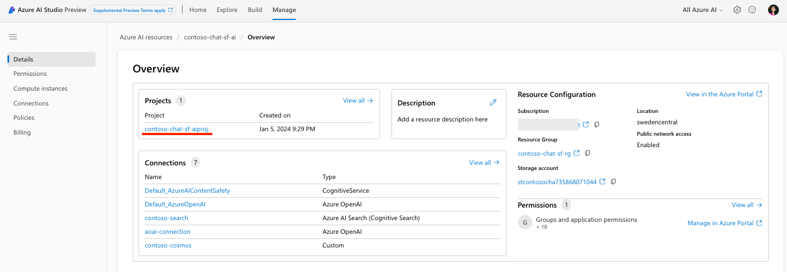
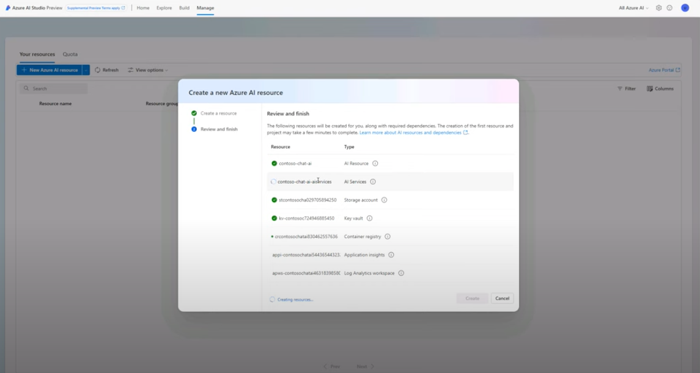

# 3.1 | Azure AI Resource

!!!info "Step 03 | Provision an Azure AI Resource to host your application environment."

!!!example "Click [**here**](https://youtu.be/1Z4sgjXTKkU?t=324) for a video walkthrough of _this step_ in a Skillable session, for reference."

## Why Do We Need it?

The [Azure AI resource](https://learn.microsoft.com/azure/ai-studio/concepts/ai-resources) provides the working environment for a team to build and manage AI applications. It is used to _provision and access _multiple Azure AI services in a single step_. The [list of Azure AI services](https://learn.microsoft.com/azure/ai-services/what-are-ai-services?context=%2Fazure%2Fai-studio%2Fcontext%2Fcontext#available-azure-ai-services) tells you what's available. The default AI Resource setup gives you these:

 - [Azure OpenAI Service](https://learn.microsoft.com/azure/ai-services/openai/) - perform a wide variety of natural language tasks (with LLMs)
 - [Azure Content Safety](https://learn.microsoft.com/azure/ai-services/content-safety/) - detect & filter unwanted content (for responsible AI)
 - [Azure Speech](https://learn.microsoft.com/azure/ai-services/speech-service/) - speech↔text conversions, translation, speaker recognition
 - [Azure Vision](https://learn.microsoft.com/azure/ai-services/computer-vision/) - analyze content in images & videos

The resource provides a centralized place for billing and configuring Azure AI services, adding connections to service endpoints, and provisioning compute for running relevant tasks. 

This is what the Azure AI Resource looks like at the end of our workshop. Note that a single AI resource can be associated with multiple _Azure AI projects_ (example underlined in red) that make use of the same provisioned AI services.

## How Do We Create It?

In this step, let's provision the Azure AI resource manually.

- [ ] **01** | Navigate to **[https://ai.azure.com](https://ai.azure.com)** in a new browser tab.
- [ ] **02** | Click **Login**. You will be automatically logged-in with prior Azure auth.
- [ ] **03** | Click **Manage** in navbar.
- [ ] **04** | Click **"+ New Azure AI resource"** in page.
- [ ] **05** | Complete the pop-up dialog with these details:
    - **Resource name:** _contoso-chat-ai_
    - **Azure subscription:** (leave default)
    - Click **"Create new resource group"**
        - **Resource group**: _contoso-chat-rg_
        - **Location**: _Sweden Central_
- [ ] **06** | Click "Next: in pop-up dialog
    - Click **Create** to confirm resource creation.
    - This takes a few minutes (see below). Wait for completion. 
- [ ] **07** | Return to "Manage" page & Refresh.
    - Verify this Azure AI resource is listed. 

## What's Next?

!!!success "Congratulations! Your Azure AI Resource was created successfully."

Clicking the resource gives you a detail page similar to the one below, except you won't see any Projects listed (like the one underlined in red) that make use of this newly-created resource. Let's create our first Azure AI project - next.

