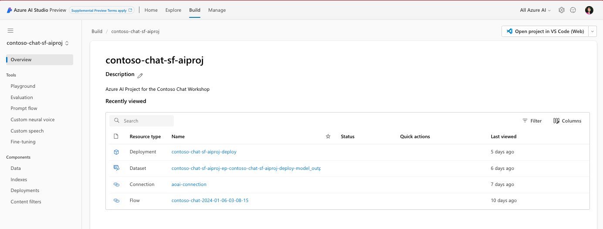

# 3.2 | Azure AI Project

!!!info "Step 04 | Provision an Azure AI Project to organize work and save state."

!!!example "Click [**here**](https://youtu.be/1Z4sgjXTKkU?t=529) for a video walkthrough of _this step_ in a Skillable session, for reference."

## Why Do We Need It?

The [Azure AI project](https://learn.microsoft.com/azure/ai-studio/how-to/create-projects) is used to _organize your work and save state, while you build custom AI apps_. Projects are hosted on an Azure AI resource. This is what the **final Azure AI project** looks like at the end of our workshop. Note how it is the single destination for discovering and configuring the various components required to _build_ our AI application.

## How Do We Create It?

> [!NOTE]
_Continue here and create resource manually only if your Azure subscription was not pre-provisioned with a lab Resource Group_

* []  **01** | Navigate to +++**https://ai.azure.com**+++ 
    - Click the **"Build"** option in navbar.
    - Click **"+ New project"**  in Projects table.
    - You should see a dialog pop up.
* [] **02** | Complete "Project details" dialog
    - **Project name**: +++contoso-chat-aiproj+++
    - **Azure AI resource**: select resource you created.
    - Click **"Create a project"**
    - This will take a few minutes to complete
    - You should be taken to created AI Project page
* [] **03** | Go back to "Build" home page
    - Click **Refresh**. (may take a few secs to appear)
    - Verify your Azure AI Project resource is listed. 

## What's Next?

🥳 **Congratulations!**   You're Azure AI Project resource is ready.
