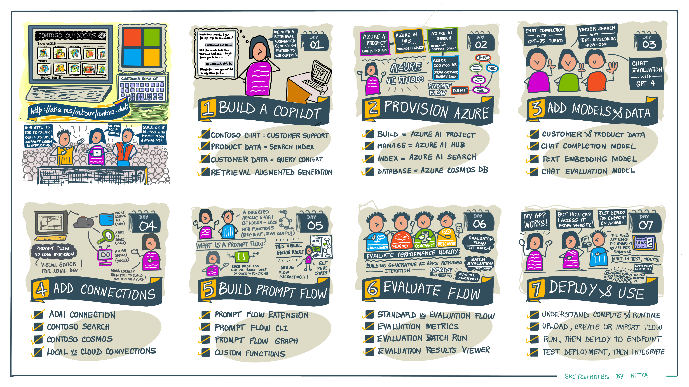

[Contoso Chat](https://aka.ms/aitour/contoso-chat) is an always-evolving open-source sample showcasing end-to-end development of a RAG-based retail copilot application on Azure AI. The sample teaches you how to go from ideation (prompt engineering) to operationalization (LLM Ops) as you build, evaluate, and deploy, a generative AI application grounded in your organization's data - as shown in the illustrated guide below.

**This is a work-in-progress.** Please check back for status updates.

{/*
import { Card, CardGrid } from '@astrojs/starlight/components';

<CardGrid >
	<Card title="1. What is LLM Ops?" icon="open-book">
		**Our App Development Lifecycle**: Learn how Generative AI applications (based on Large Language Models) differ from traditional AI applications (based on custom ML models). Understand the paradigm shift from MLOps to LLMOps.
	</Card>
	<Card title="2. What is Azure AI Studio?" icon="open-book">
		**Our AI Platform:** Learn how Azure AI Studio provides a unified platform to explore, build, and manage, generative AI app development. Get familiar with the core AI resources, low-code (UI) and code-first (SDK/CLI) support.
	</Card>
	<Card title="3. What is prompt flow?" icon="open-book">
		**Our Orchestration Tool:** Streamline your build-run-evaluate-deploy workflow with custom functions and visual tools. Get familiar with using the Visual Studio Code extension for local and cloud-connected development support.
	</Card>
	<Card title="4. What is Contoso Chat?" icon="open-book">
		**Our Application Scenario:** Define your requirements & identify workflow. Understand prompt engineering concepts. Identify your data sources and model deployments. Visualize the end user experience for integration.
	</Card>
	<Card title="5. What is RAG?" icon="open-book">
		**Our Application Architecture:** Understand Retrieval Augmented Generation (RAG) and related concepts like vector search, indexing and text-embeddings. Learn how to ground prompt responses in your data with AI search.
	</Card>
	<Card title="6. Setup Dev Environment" icon="setting">
		**Our Recommended Approach:** Building the application requires multiple tools and services, some in preview (actively evolving). Use our pre-built (devcontainer) environment for quickstarts with least manual effort.
	</Card>
	<Card title="7. Provision Azure, Configure" icon="setting">
		**Our Cloud Environment:** Get familiar with the different options (Portal, CLI, Script, SDK) for provisioning the required resources. Pick an option and complete provisioning. Configure local environment to use Azure.
	</Card>
	<Card title="8. Review Model Deployments" icon="setting">
		**Completion, Embedding, Evaluation:** Provisioning an AI project will include setting up an LLM provider (e.g., Azure OpenAI) and creating required model deployments. Review what they are, and why they are needed.
	</Card>
	<Card title="9. Populate Your Data" icon="setting">
		**Think Indexes and Activity** Populate the AI search resource with indexes built on the product data. Populate the Cosmos DB resource with databases built on customer activity data. Understand where each is used.
	</Card>
	<Card title="10. Create Your Connections" icon="setting">
		**Our Cloud Environment:** Connect your prompt flow tooling to any services required by its workflow nodes (functions). This includes Azure OpenAI (models), Azure CosmosDB (customer data), Azure AI Search (product index).
	</Card>
	<Card title="11. Build & Run the prompt flow" icon="setting">
		**Use VSCode Extension:** Open the contoso-chat prompt flow in a visual editor. Understand the structure, the code, and the tooling capabilities. Run the flow & validate with a simple question. Trace the flow & view the metrics.
 	</Card>
	<Card title="12. Evaluate the prompt flow" icon="setting">
		**Think Responsible AI:** Understand what evaluation flows do. Understand concepts (base run, variants) and metrics (groundedness, fluency, coherence, relevance). Explore the results. Understand batch vs. manual testing. 
	</Card>
	<Card title="13. Deploy the prompt flow" icon="setting">
		**Create Integration Endpoint:** Understand concept of compute and runtime. Explore options (push & deploy from UI, use CLI/SDK) to deploy promtptlow. Understand deployment process and built-in testing for endpoint.
	</Card>
	<Card title="14. Integrate chat API in app" icon="setting">
		**Hello, Contoso Outdoors:** Understand how to access the deployed endpoint for testing or integration. Explore the open-source contoso-web sample app and learn to integrate your deployed chat app for a real demo (interactive usage).
	</Card>
	<Card title="15. Automate Deployment 🚧" icon="puzzle">
		**TODO: Using GitHub Actions** 
	</Card>
	<Card title="16. Intent-Based Routing 🚧" icon="puzzle">
		**TODO: Using Multiple Agents** 
	</Card>
	<Card title="17. Add Content Safety 🚧" icon="puzzle">
		**TODO: Using Content Filters** 
	</Card>
	<Card title="18. Use Open-Source LLM 🚧" icon="puzzle">
		**TODO: Using Hugging Face Hub** 
	</Card>
	<Card title="19. Use Open-Source App 🚧" icon="puzzle">
		**TODO: Using Hugging Chat** 
	</Card>
	<Card title="20. Use Agent Framework 🚧" icon="puzzle">
		**TODO: Using Autogen**
	</Card>
</CardGrid>
*/}

